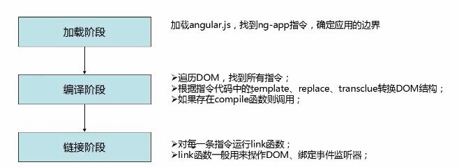

<b>This is a angular-demos, It can show my progress of study.</b>
## 02directive——Angularjs的创建指令方法
### restrict 值分类:
- E 作为元素名使用,例如：`<hello></hello>`  
- A 作为属性使用(默认),例如：`<div hello></div>`
- C 作为类名使用 , 例如：`<div class="hello"></div>`
- M 作为注释使用,  例如：`<!--directive:hello-->`
### directive的templateUrl属性
通常我们这样写，template，但是如果模板里面东西很多，我们就需要独立出来一个html文件，
```
    myApp.directive('hello',function(){
        return{
            restrict : 'AEMC', //- A 作为属性使用(默认),例如：`<div hello></div>`
            template : '<div>Hello everyone, I am bangbang!</div>',
            replace : true
        }
    })
```
用templateUrl属性独立出html文件,**注意：**如果用longDirective命名，引用的时候用`<long-directive></long-directive>`,要不然就用纯小写字母

```
    myApp.directive('longDirective',function(){
        return {
            restrict : 'AEMC',  //- E 作为元素名使用,例如：`<hello></hello>`  
            templateUrl : 'tpls/long.html',
            replace : true
        }
    })
```
### $templateCache(缓存模板方法)
&emsp;&emsp;通过angular创建的模块,都有一个run方法,注射器在加载完成所有模块的时候，该方法使用一次。接受一个函数作为参数.该函数会被执行.$templateCache是angular内置的一个服务,它的put方法用于存放模板.它接受两个参数,第一个参数为模板的名字,第一个参数为模板的名字,也就是templateUrl的值,cache.html,第二个参数就是html字符串,也就是模板的内容.
&emsp;&emsp;这种方法常用于模板内容是通过$http异步获取的.然后将模板放入$templateCache中以便后面使用.

```
    myApp.run(function($templateCache){
        // $templateCache.put('tpls/cache.html','<div>hello everyone!!!!</div>')
        $templateCache.put('cache.html','<p>我是缓存的模板</p>')
    });
    myApp.directive('cacheDirective',function($templateCache){
        return{
            restrict : 'AECM',
            template : $templateCache.get('cache.html'),
            replace : true
        }
    })
```
### transclude属性的使用(让创建的标签里面的内容不被替换)
下面代码让html页面中的`<no-Replace>希望我不被替换掉</no-Replace>`里面的内容不会被替换
```
    myApp.directive("noReplace",function(){
        return {
            restrict : 'AECM',
            template : "<div>Hello everyone,I am noReplace!</div><div ng-transclude></div>",
            transclude : true
        }
    })
```
### compile与link
&emsp;&emsp;Angularjs的运行流程如下所示：


- compile函数用来对模板自身进行转换，link函数负责在模型和视图之间进行动态关联；
- 作用域在链接阶段才会被绑定到编译之后的link函数上；
- compile函数仅仅在便一阶段运行一次，而对于指令的每个实例，link函数都会执行一次；
- compile可以返回preLink和postLink函数，而link函数只会返回postLink函数；
- 如果需要修改DOM结构，应该在postLink中来做这件事，而如果preLink中做这件事情会导致失误，大所属时候我们只需要编写link函数即可；

```
    myApp.directive('cpl',function(){
        return {
            restrict : 'AECM',
            template : '<div>Hello bangbang</div>',
            replace : true,
            compile : function(){ //用来对模板自身进行转换

            },
            link : function(){ //用来操作DOM和绑定事件监听器

            }
        }
    })
```
